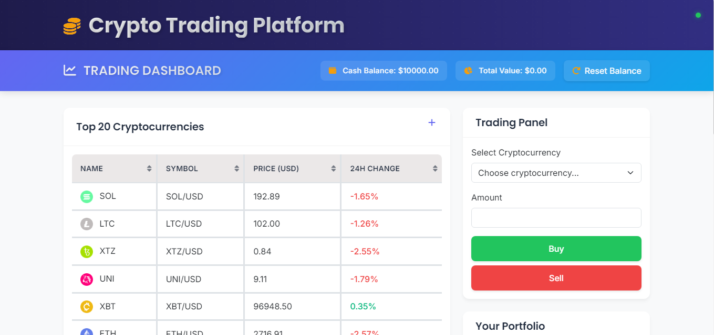

# 🚀 Cryptocurrency Trading Simulator

<div align="center">

[](https://www.oracle.com/java/)
[](https://spring.io/projects/spring-boot)
[](https://reactjs.org/)
[](LICENSE)

🎮 Practice Crypto Trading with Zero Risk | 💹 Real-Time Market Data | 💰 Virtual Portfolio

[Getting Started](#-getting-started) •
[Features](#-features) •
[Installation](#-installation) •
[Usage](#-how-to-use) •
[Contributing](#-contributing)



</div>

## 🌟 Features

### 📊 Real-Time Trading Experience
- **Live Price Updates** - Real-time cryptocurrency prices from Kraken
- **Market Data** - Price charts, order books, and trading volume
- **Top 20 Cryptocurrencies** - Track major crypto assets

### 💼 Portfolio Management
- **Virtual Balance** - Start with $10,000 virtual currency
- **Portfolio Tracking** - Real-time value updates
- **Position Management** - Track all your crypto holdings

### 📱 User-Friendly Interface
- **Responsive Design** - Works on desktop and mobile
- **Intuitive Controls** - Easy-to-use trading interface
- **Real-Time Updates** - Instant feedback on actions

### 📝 Transaction Features
- **Buy & Sell** - Execute trades with virtual money
- **Transaction History** - Complete log of all trades
- **Profit/Loss Tracking** - Monitor your performance

## 🚀 Getting Started

### Prerequisites

Before you begin, ensure you have the following installed:

- ☕ Java 17 or higher
- 📦 Node.js and npm
- 🛠️ Maven

### 🔧 Installation

1️⃣ **Clone the Repository**
```bash
git clone https://github.com/xgaming6285/crypto-trading-simulator.git
cd crypto-trading-simulator
```

2️⃣ **Start Backend Server**
```bash
mvn spring-boot:run
```

3️⃣ **Launch Frontend**
```bash
cd frontend
npm install
npm start
```

4️⃣ **Access the Platform**
- Open your browser
- Navigate to `http://localhost:3000`
- Start trading! 🎉

## 📱 How to Use

### 1️⃣ View Market Data
- 📊 Real-time price charts
- 📈 24-hour price changes
- 📉 Trading volume indicators

### 2️⃣ Execute Trades
1. Select cryptocurrency
2. Enter amount
3. Choose Buy/Sell
4. Confirm transaction

### 3️⃣ Manage Portfolio
- 👀 Monitor holdings
- 💰 Track total value
- 📊 Analyze performance

### 4️⃣ View History
- 📜 Complete transaction log
- 💹 Profit/Loss tracking
- 🕒 Timestamp details

## 🛠️ Technical Architecture

### Frontend Stack
- ⚛️ React.js
- 🎨 Material-UI
- 🔌 WebSocket Client
- 📱 Responsive Design

### Backend Stack
- ☕ Java Spring Boot
- 🔌 WebSocket Server
- 🔄 Kraken API Integration
- 💾 In-memory Storage

## 🤝 Contributing

We welcome contributions! Here's how you can help:

1. 🍴 Fork the repository
2. 🌿 Create a feature branch (`git checkout -b feature/AmazingFeature`)
3. 💾 Commit changes (`git commit -m 'Add AmazingFeature'`)
4. 📤 Push to branch (`git push origin feature/AmazingFeature`)
5. 📩 Open a Pull Request

## 📄 License

This project is licensed under the MIT License - see the [LICENSE](LICENSE) file for details.

## 🆘 Support

Need help? We're here for you!

- 📧 Email: dani034406@gmail.com

## 🙏 Acknowledgments

- 🙌 Kraken API Team
- 💻 Spring Boot Community
- ⚛️ React.js Community

---

<div align="center">

Made with ❤️ by [Dani]

[⬆ Back to Top](#cryptocurrency-trading-simulator)

</div>

