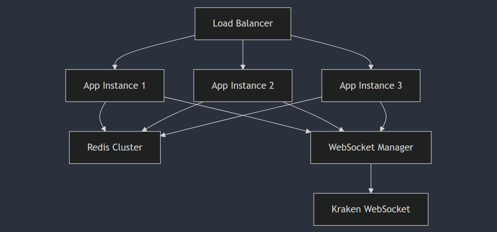

Scaling Strategy for Crypto Trading Simulator
1. Horizontal Scaling Architecture
# Scaling Strategy

## Architecture Overview

### 1. Load Balancing
- Implement AWS Elastic Load Balancer or NGINX for request distribution
- Use sticky sessions for WebSocket connections
- Health checks to route traffic only to healthy instances

### 2. State Management
- Replace in-memory storage with Redis cluster:
  - User portfolios
  - Transaction history
  - Real-time price data
  - Session management
- Benefits:
  - Shared state across instances
  - Data persistence
  - High availability
  - Built-in pub/sub for real-time updates

### 3. WebSocket Management
- Implement WebSocket manager service:
  - Single connection to Kraken per cluster
  - Distribute updates via Redis pub/sub
  - Handle reconnection logic centrally
- Benefits:
  - Reduced external connections
  - Consistent price updates
  - Better resource utilization

### 4. Caching Strategy
- Multi-level caching:
  - Local instance cache (short-lived)
  - Redis cache (shared)
  - Cache invalidation via pub/sub
- Benefits:
  - Reduced latency
  - Lower database load
  - Consistent data across instances

### 5. Database Considerations
- Implement persistent storage:
  - User portfolios
  - Transaction history
  - Price history
- Use read replicas for scaling reads
- Implement connection pooling
- Consider sharding for large datasets

### 6. Monitoring and Scaling
- Implement metrics collection:
  - Instance health
  - WebSocket connections
  - Transaction volume
  - Response times
- Auto-scaling based on:
  - CPU utilization
  - Memory usage
  - Connection count
  - Request latency

### 7. Security Considerations
- Rate limiting per instance
- DDoS protection at load balancer
- Session management across instances
- Secure WebSocket connections

## Implementation Steps

1. **Redis Integration**
java:src/main/java/com/cryptotrading/config/RedisConfig.java
@Configuration
public class RedisConfig {
@Bean
public RedisTemplate<String, Object> redisTemplate(RedisConnectionFactory connectionFactory) {
RedisTemplate<String, Object> template = new RedisTemplate<>();
template.setConnectionFactory(connectionFactory);
template.setKeySerializer(new StringRedisSerializer());
template.setHashKeySerializer(new StringRedisSerializer());
template.setHashValueSerializer(new JdkSerializationRedisSerializer());
template.setValueSerializer(new JdkSerializationRedisSerializer());
return template;
}
}

2. **WebSocket Manager Service**
java:src/main/java/com/cryptotrading/service/WebSocketManagerService.java
@Service
@Slf4j
public class WebSocketManagerService {
private final RedisTemplate<String, Object> redisTemplate;
private final KrakenWebSocketService krakenService;
public WebSocketManagerService(RedisTemplate<String, Object> redisTemplate,
KrakenWebSocketService krakenService) {
this.redisTemplate = redisTemplate;
this.krakenService = krakenService;
}
public void broadcastPriceUpdate(String symbol, double price) {
String channel = "price-updates";
Map<String, Object> message = Map.of(
"symbol", symbol,
"price", price,
"timestamp", System.currentTimeMillis()
);
redisTemplate.convertAndSend(channel, message);
}
}

3. **Metrics Collection**
java:src/main/java/com/cryptotrading/config/MetricsConfig.java
@Configuration
public class MetricsConfig {
@Bean
public MeterRegistry meterRegistry() {
return new SimpleMeterRegistry();
}
@Bean
public MetricsService metricsService(MeterRegistry registry) {
return new MetricsService(registry);
}
}

## Performance Considerations

1. **Connection Pooling**
- Implement connection pools for Redis and databases
- Configure optimal pool sizes based on instance capacity
- Monitor connection usage and adjust accordingly

2. **Caching Strategy**
- Cache frequently accessed data locally
- Use Redis for shared cache
- Implement cache eviction policies
- Monitor cache hit rates

3. **Resource Optimization**
- Configure instance memory allocation
- Optimize garbage collection
- Monitor thread pool usage
- Implement circuit breakers for external services

## Deployment Strategy

1. **Blue-Green Deployment**
- Maintain two identical environments
- Zero-downtime deployments
- Easy rollback capability

2. **Container Orchestration**
- Use Kubernetes for container management
- Implement auto-scaling
- Handle health checks and restarts
- Rolling updates

3. **Geographic Distribution**
- Deploy to multiple regions
- Use DNS-based routing
- Implement data replication
- Consider latency requirements

## Monitoring and Alerting

1. **Key Metrics**
- Instance health
- WebSocket connections
- Transaction volume
- Response times
- Error rates
- Cache hit rates
- Redis cluster health

2. **Alerting**
- Set up alerts for:
  - High error rates
  - Elevated latency
  - Connection issues
  - Resource utilization
  - Instance health

3. **Logging**
- Centralized logging
- Log aggregation
- Error tracking
- Performance monitoring

